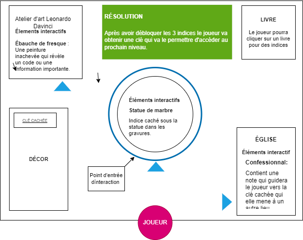
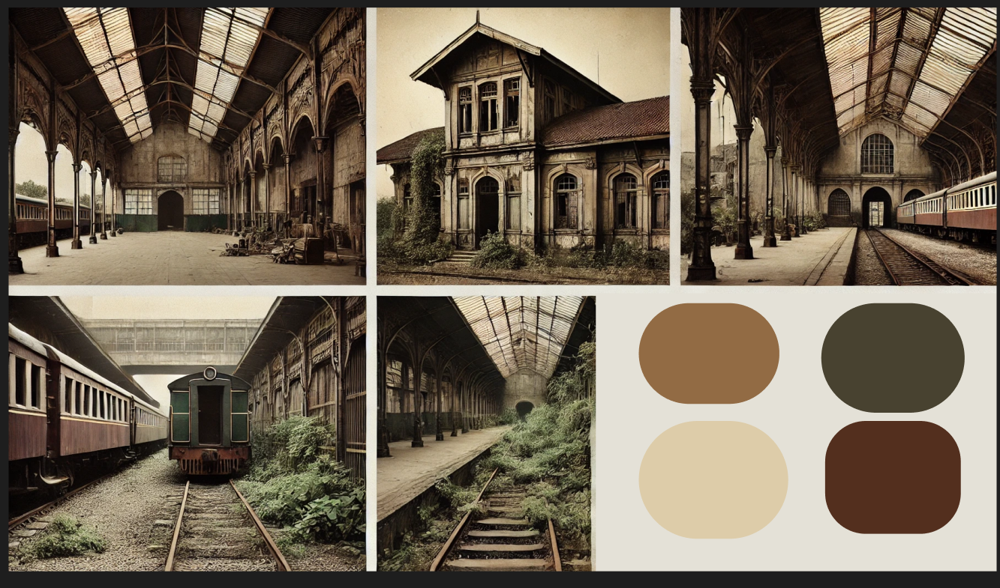
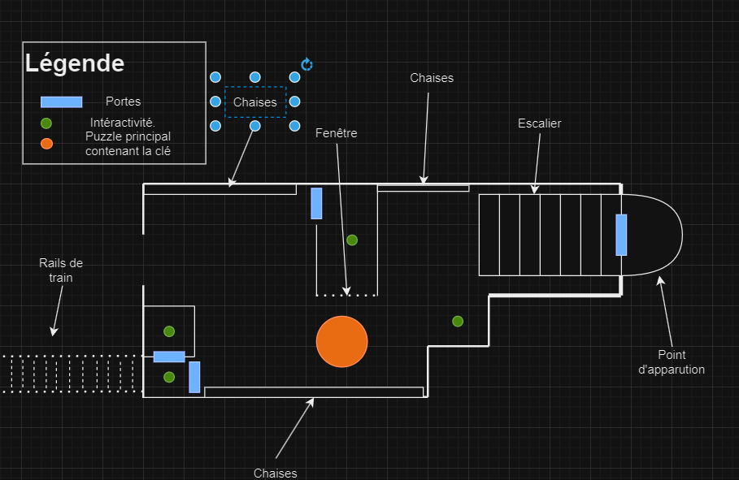
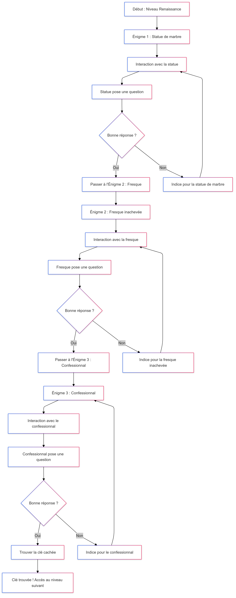

# Chrono Escape
----

## Équipe 
| Nom           | Username Github|
|---------------|----------------|
| Pierre-Luc Proulx  | Timingmerkat83|
| Rata Ikrame   | ikramert |
| Matis Ghariani | 2shiestymat|

## Résumé
Notre projet est un escape game en VR où chaque niveau réussi téléporte les joueurs à une nouvelle époque, les amenant progressivement jusqu'à l'époque actuelle. 
## Description
Le projet Chrono Escape est un jeu d’évasion en réalité virtuelle où les joueurs sont plongés dans différentes époques historiques. Chaque niveau représente une période clé de l’histoire, et les joueurs doivent résoudre des énigmes spécifiques à chaque époque pour se téléporter à la suivante. Leur objectif final est de revenir à l’époque actuelle après avoir traversé trois époques : la Renaissance, l'année 1945, et un futur dystopique de style cyberpunk.

----

## Renaissance (15ème siècle)
### Résumé du monde
La Renaissance transporte les joueurs dans une ville italienne du 15ᵉ siècle, où ils explorent l'art de l'époque à travers des énigmes inspirées de Léonard de Vinci.

### Visuel
#### Renaissance

### Sonore
Renaissance: [Musique Renaissance](https://www.youtube.com/watch?v=1YiAmTYz9SE)

### Carte de l'Environnement Virtuel

#### Elements à créer
Je vais modeliser la fresque de Davinci.

#### Elements interactifs

Lieu principal : Ville italienne, 15ᵉ siècle.
Place Centrale
- Fontaine historique
- Statue de marbre : Indice caché sous la statue ou dans les gravures.

Atelier d'art de Leonardo Davinci
- Ébauche de fresque : Une peinture inachevée qui révèle un code ou une information importante.

Église
- Confessionnal : Contient une note cachée ou une clé menant à un autre lieu.
----

## Époque Moderne (1945) – Ville Européenne
### Résumé du monde
Le monde de l'époque moderne transporte les joueurs dans une gare ferroviaire abandonnée de 1945, où un quai désert et des trains partiellement détruits regorgent d'indices cachés sous les sièges et dans les compartiments, les plongeant dans une atmosphère mystérieuse et chargée d'histoire.

#### 2e Guerre mondiale, Gare de train abandonnée

 ### Elements interactifs
 Lieu principal: Gare de train abandonnée
 #### Main Lobby
 - Lobby de train ordinaire avec des chaises et des herbes.
 - Vieille statues couvert d'herbe

#### Tunnel de train
- Contient une indice à l'égnigme du niveau.

----

## Époque futuriste cyberpunk
Dans une métropole dystopique futuriste, les joueurs explorent une rue cyberpunk étroite, illuminée de néons et de publicités holographiques, où le street art numérique révèle des indices cachés.

### Visuel

### Sonore

### Elements interactifs

----

## Schéma de Programmation pour le jeu 
### Renaissance (Premier niveau)

[Graphique mermaid](./schemas/renaissance.md)
