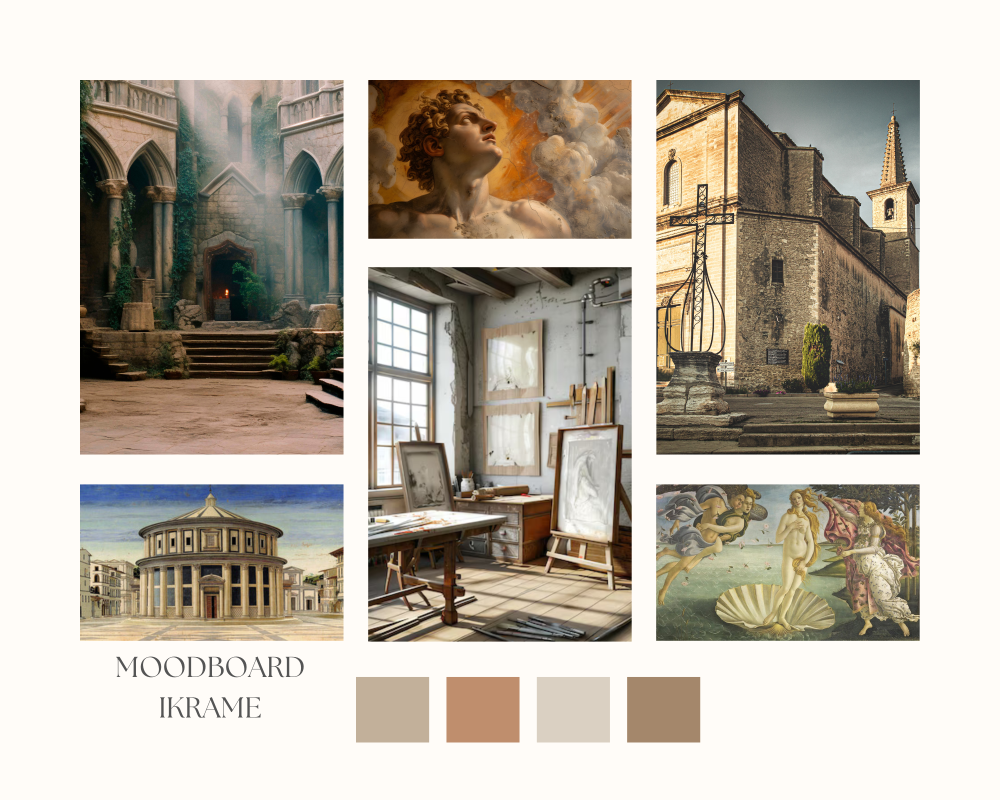
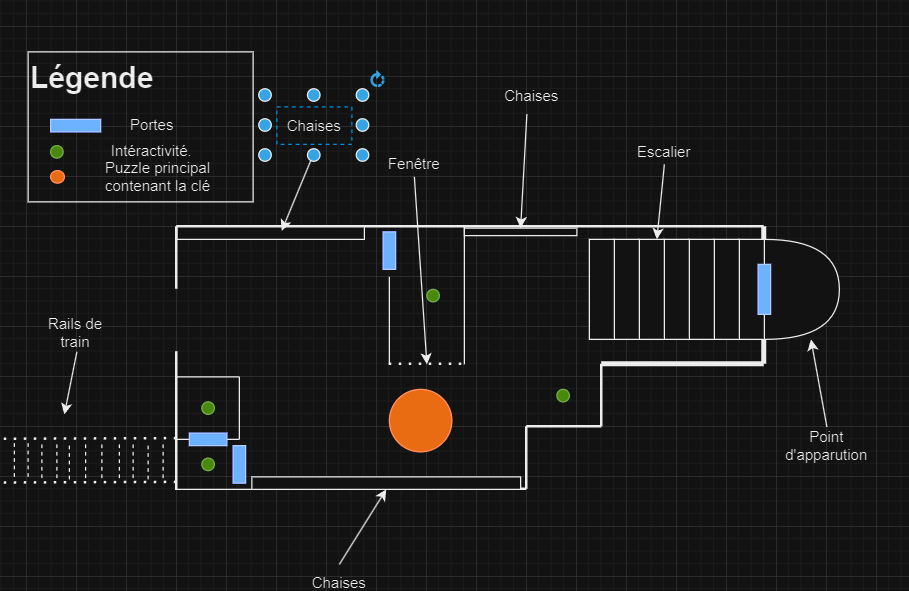

# Chrono Escape

----

## Équipe 
| Nom           | Username Github|
|---------------|----------------|
| Pierre-Luc Proulx  | Timingmerkat83|
| Rata Ikrame   | ikramert |
| Matis Ghariani | 2shiestymat|

## Résumé
Notre projet est un escape game en VR où chaque niveau réussi téléporte les joueurs à une nouvelle époque, les amenant progressivement jusqu'à l'époque actuelle. 
## Description
Le projet Chrono Escape est un jeu d’évasion en réalité virtuelle où les joueurs sont plongés dans différentes époques historiques. Chaque niveau représente une période clé de l’histoire, et les joueurs doivent résoudre des énigmes spécifiques à chaque époque pour se téléporter à la suivante. Leur objectif final est de revenir à l’époque actuelle après avoir traversé trois époques : la Renaissance, l'année 1945, et un futur dystopique de style cyberpunk.
## Moodboard

### Visuel
#### Renaissance

#### 2e Guerre mondiale, Gare de train abandonnée

### Sonore

Renaissance : [Musique Renaissance](https://www.youtube.com/watch?v=1YiAmTYz9SE)
1945: [Musique 1945](https://www.youtube.com/watch?v=OfWc52smNs8&list=PLeulUC74_O8TfKoX2muaphFeCGZ3ms7qe)
Cyberpunk: [Musique Cyberpunk ambiante](https://www.youtube.com/watch?v=zIpXoohOg44&list=RDQMguiWwTjmfiI&start_radio=1)

----
## Premier monde: Renaissance

### Résumé du monde
La Renaissance transporte les joueurs dans une ville italienne du 15ᵉ siècle, où ils explorent l'art de l'époque à travers des énigmes inspirées de Léonard de Vinci.

### Carte de l'Environnement Virtuel

### Renaissance (15ème siècle)
    •	Lieu principal : Nous sommes dans une ville italienne 
    •  Place centrale
    •  Atelier d'art Davinci 
    •  Église 

#### Elements interactifs

   ----
### Époque Moderne (1945) – Ville Européenne

    •	Lieu principal: Gare ferroviaire abandonee
    •	Un quai désert avec des trains partiellement détruits. Les joueurs doivent explorer les wagons pour trouver des indices cachés sous les   sièges ou dans les compartiments.

 ### Elements interactifs

   - Énigme de la fresque : Les joueurs doivent résoudre une énigme en utilisant des indices cachés dans une fresque peinte dans l'atelier de Léonard de Vinci.
   - Invention de Léonard : Un mécanisme interactif qui permet aux joueurs de manipuler une maquette d'une machine de Léonard de Vinci, débloquant ainsi un indice lorsque la machine est correctement assemblée.
   - Église de la découverte : Les joueurs doivent découvrir un passage secret derrière un autel dans l'église en résolvant une énigme liée aux symboles religieux.
 ----
### Époque futuriste cyberpunk
    •	Lieu principal : Métropole dystopique
    •	Rue cyberpunk : Une rue étroite remplie de néons, de panneaux publicitaires holographiques, où les joueurs interagiront avec des éléments de street art numérique pour trouver des indices.
 ### Elements interactifs

## Schéma de Programmation ou d'Interactivité

