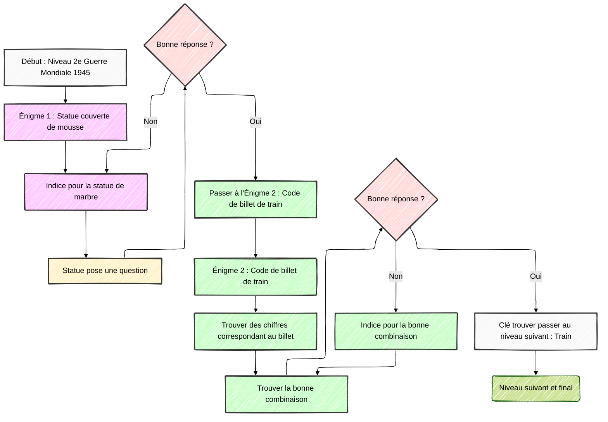

```mermaid
---
config:
  theme: forest
  look: handDrawn
  layout: elk
---
flowchart TD
    A["Début : Niveau 2e Guerre Mondiale 1945"] --> B["Énigme 1 : Statue couverte de mousse"]
    B --> C["Indice pour la statue de marbre"]
    C --> D["Statue pose une question"]
    D --> E{"Bonne réponse ?"}
    E -- Oui --> F["Passer à l'Énigme 2 : Code de billet de train"]
    E -- Non --> C
    F --> H["Énigme 2 : Code de billet de train"]
    H --> I["Trouver des chiffres correspondant au billet"]
    I --> J["Trouver la bonne combinaison"]
    J --> K{"Bonne réponse ?"}
    K -- Non --> N["Indice pour la bonne combinaison"]
    N --> J
    K -- Oui --> M["Clé trouver passer au niveau suivant : Train"]
    M ----> O("Niveau suivant et final")
     A:::startend
     B:::enigme1
     C:::enigme1
     C:::enigme1
     D:::question
     E:::decision
     F:::enigme2
     H:::enigme2
     I:::enigme2
     J:::enigme2
     K:::decision
     N:::enigme2
     M:::startend
    classDef startend fill:#f9f9f9,stroke:#333,stroke-width:2px
    classDef enigme1 fill:#FFCCFF,stroke:#333,stroke-width:2px
    classDef enigme2 fill:#CCFFCC,stroke:#333,stroke-width:2px
    classDef enigme3 fill:#CCCCFF,stroke:#333,stroke-width:2px
    classDef question fill:#FFF3CC,stroke:#333,stroke-width:2px
    classDef decision fill:#FFDDDD,stroke:#333,stroke-width:2px

    

```
