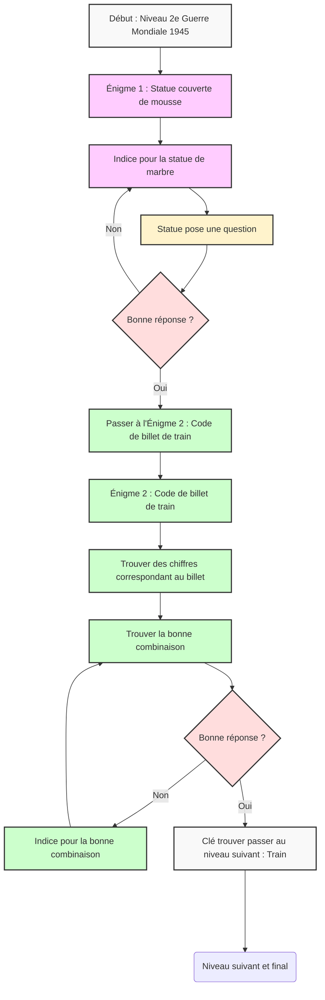

```mermaid
graph TD;
    classDef startend fill:#f9f9f9,stroke:#333,stroke-width:2px;
    classDef enigme1 fill:#FFCCFF,stroke:#333,stroke-width:2px;
    classDef enigme2 fill:#CCFFCC,stroke:#333,stroke-width:2px;
    classDef enigme3 fill:#CCCCFF,stroke:#333,stroke-width:2px;
    classDef question fill:#FFF3CC,stroke:#333,stroke-width:2px;
    classDef decision fill:#FFDDDD,stroke:#333,stroke-width:2px;

    A[Début : Niveau 2e Guerre Mondiale 1945]:::startend --> B[Énigme 1 : Statue couverte de mousse]:::enigme1;
    B --> C[Interaction avec la statue]:::enigme1;
    C --> D[Statue pose une question]:::question;

    %% Vérification de la réponse de la statue
    D --> E{Bonne réponse ?}:::decision;
    E -- Oui --> F[Passer à l'Énigme 2 : Code de billet de train]:::enigme2;
    E -- Non --> C[Indice pour la statue de marbre]:::enigme1;

    %% Énigme 2 : 
    F --> H[Énigme 2 : Code de billet de train]:::enigme2;
    H --> I[Trouver des chiffres correspondant au billet]:::enigme2;
    I --> J[Trouver la bonne combinaison]:::enigme2;

    %% Vérification de la réponse de la fresque
    J --> K{Bonne réponse ?}:::decision;
   
    K -- Non --> N[Indice pour la bonne combinaison]:::enigme2;
    N --> J;

    %% Obtention de la clé et boucles de retour
    K -- Oui --> M[Clé trouver passer au niveau suivant : Train]:::startend;
    M ----> O(Niveau suivant et final);

    

```
