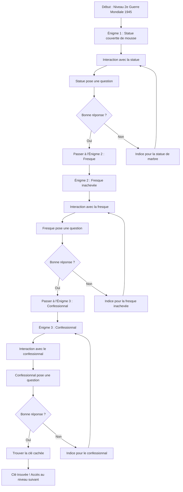

```mermaid
graph TD;
    A[Début : Niveau 2e Guerre Mondiale 1945] --> B[Énigme 1 : Statue couvertte de mousse];
    B --> C[Interaction avec la statue];
    C --> D[Statue pose une question];

    %% Vérification de la réponse de la statue
    D --> E{Bonne réponse ?};
    E -- Oui --> F[Passer à l'Énigme 2 : Fresque];
    E -- Non --> G[Indice pour la statue de marbre];

    %% Énigme 2 : Fresque
    F --> H[Énigme 2 : Fresque inachevée];
    H --> I[Interaction avec la fresque];
    I --> J[Fresque pose une question];

    %% Vérification de la réponse de la fresque
    J --> K{Bonne réponse ?};
    K -- Oui --> L[Passer à l'Énigme 3 : Confessionnal];
    K -- Non --> M[Indice pour la fresque inachevée];

    %% Énigme 3 : Confessionnal
    L --> N[Énigme 3 : Confessionnal];
    N --> O[Interaction avec le confessionnal];
    O --> P[Confessionnal pose une question];

    %% Vérification de la réponse du confessionnal
    P --> Q{Bonne réponse ?};
    Q -- Oui --> R[Trouver la clé cachée];
    Q -- Non --> S[Indice pour le confessionnal];

    %% Obtention de la clé et boucles de retour
    R --> T[Clé trouvée ! Accès au niveau suivant];
    S --> N;
    G --> C;
    M --> I;
```
